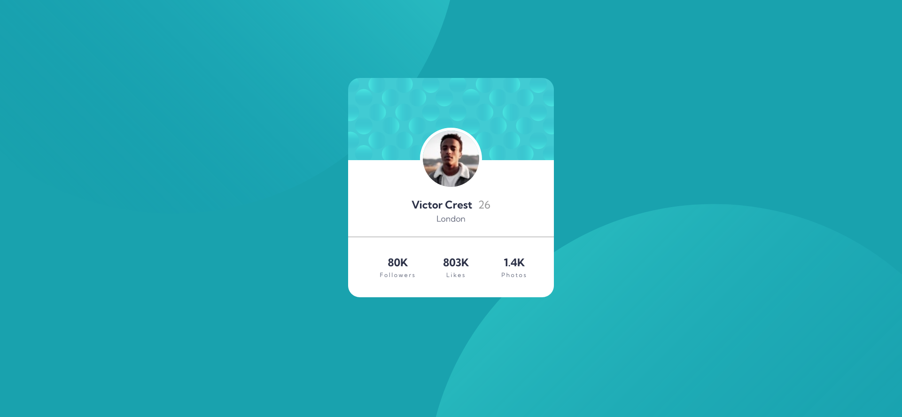

# Frontend Mentor - Profile card component solution

This is a solution to the [Profile card component challenge on Frontend Mentor](https://www.frontendmentor.io/challenges/profile-card-component-cfArpWshJ). Frontend Mentor challenges help you improve your coding skills by building realistic projects. 

## Table of contents

- [Overview](#overview)
  - [The challenge](#the-challenge)
  - [Screenshot](#screenshot)
  - [Links](#links)
- [My process](#my-process)
  - [Built with](#built-with)
  - [What I learned](#what-i-learned)
- [Author](#author)
- [Acknowledgments](#acknowledgments)

## Overview

### The challenge

- Build out the project to the designs provided

### Screenshot



### Links

- Solution URL: [https://github.com/cisneConCorbata/frontEndMentor-profileCard](https://github.com/cisneConCorbata/frontEndMentor-profileCard)
- Live Site URL: [https://cisneconcorbata.github.io/frontEndMentor-profileCard](https://cisneconcorbata.github.io/frontEndMentor-profileCard)

## My process

### Built with

- Semantic HTML5 markup
- CSS custom properties
- Flexbox
- CSS Grid

### What I learned

- How to create variables

```
:root {
  --cyan: hsl(185, 75%, 39%);
  --blue: hsl(229, 23%, 23%);
  --gray: hsl(227, 10%, 46%);
  --darkGray: hsl(0, 0%, 59%);
}
```

## Author

- Website - [Cisne con corbata](https://cisneconcorbata.github.io/cisnesPortfolio/)
- Frontend Mentor - [@cisneConCorbata](https://www.frontendmentor.io/profile/cisneConCorbata)

## Acknowledgments

- I learned how to create variables from [@AlvaNeedsFood](https://www.frontendmentor.io/profile/AlvaNeedsFood)